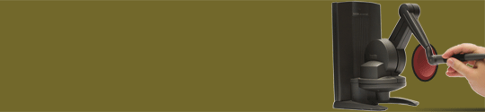

  

## Virtual Button Feedback

While working on [M4][], I noticed that I spent a lot of time explaining how to interact with the pushbuttons in the virtual workspace. I was curious what made the buttons hard to interact with, and what kind of feedback would help to clarify how to interact with virtual buttons.

[M4]:  m4.html

I developed a framework for generating multimodal feedback from virtual buttons. When the user presses one of these virtual buttons holding a force-feedback device, it may generate a haptic _click_ sensation. Working with [my advisor][harding], we experimented with generating additional visual and audio feedback for the buttons.

[harding]: http://www.hci.iastate.edu/~charding/
