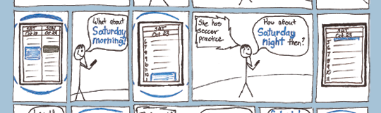

## User Experience

I drew the storyboard above as part of a group project to develop a prototype of a memory aid for older adults. During the project, I was involved in interviewing users to create personas, developing paper prototypes, and evaluating the prototypes through user testing.

## IBM Co-op

While a user experience co-op at IBM, I worked to improve software for database administrators. After I helped to identify a problematic interaction in one of the tools, I recruited a group of stakeholders to promote and guide a project to redesign the interaction. My mentor helped me gain experience developing five iterations of the design. I was responsible for setting goals, interviewing users, creating a task analysis, designing prototypes, user testing with the prototypes, involving stakeholders in the process, and communicating the design to a remote development team.

## CHI Student Design Competition

I also organized a multidisciplinary team of students to submit a project for the 2009 CHI Student Design Competition. The competition theme was sustainability, and we developed a service to assist college students in finding convenient local food to use in simple recipes. I was actively involved in interviewing, task analysis, user testing, and iterative design of the prototypes.

Our team was invited to the CHI conference to present during the poster session and we finished as semi-finalists. 
